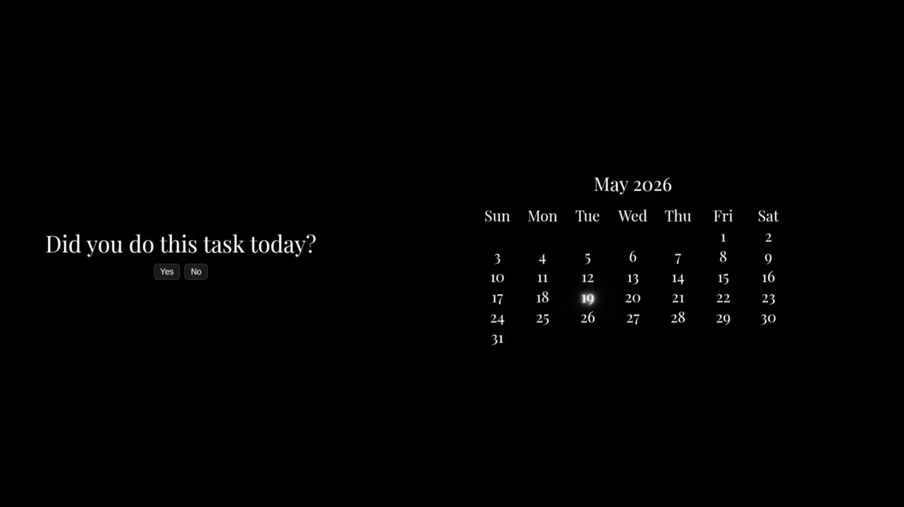

# watership 🌿

a simple habit tracker. did you do the thing today? yes or no.

[live demo](https://watership.vercel.app/)


## what it does

one habit, one question a day. if you did it, that day gets a pencil-sketch strikethrough on the calendar. that's it. no streaks, no points, no nonsense.

- daily yes/no check-in
- month calendar with today highlighted
- pencil-sketch strikethroughs for completed days
- prev/next month navigation


## stack

- react
- css
- html i guess.. theres nothing else lol

## running locally

```bash
git clone https://github.com/yourusername/watership
cd watership
npm install
npm run dev
```

## roadmap

- [ ] localStorage for persistence
- [ ] retroactive calendar (see past completions)
- [ ] multiple habits
- [ ] deploy on vercel

## why watership

> *"All the world will be your enemy, Prince of a Thousand enemies. And when they catch you, they will kill you. But first they must catch you."*
> — Watership Down

just keep going.

---

made in meghalaya 🏔️